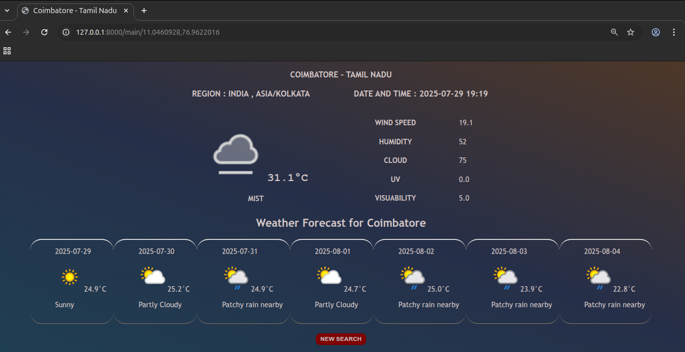

## WEATHER APPLICATION WITH DJANGO AND API'S 

A Django-based Weather Application using the WeatherAPI that are allows to find the Weather and Forecast by Location (GPS) Method. Focues on clean and responsive design pattern. They are using the technology of python, django, API's, HTML, CSS, JavaScript 

## FEATURES 
- Search by City or Coordinates 
- Show a Current Weather Details like (Temperature, Humidity, etc.,) 
- Auto location Detection by Clicking a button 
- Focuses on clean User Interface (UI) , Smoothly Animated
- Clean Responsive design 
- LAT, LONG passed via URL for Dynamic Search 

## TECHNOLOGIES USED 
- **Backend:** Django, Python, WeatherAPI's
- **Frontend:** HTML, CSS, JavaScript
- **Database:** SQLite
- **Deployment**:Git and Version Control 

## PROJECT STRUCTURE 
```bash 
    Weather Application/
├── templates/
├── static/
├── wethr
├── wethr_app
├── LICENSE    
├── db.sqlite3 
├── manage.py
└── README.md 
```
## INSTALLATION 

### 1. Clone the Repository 
```bash
    git clone https://github.com/GOKUL988/Weather-Application-.git
```
```bash 
    cd Weather-application-
```
### 2. Create & Activate Virtual Environment
``` bash 
    LINUX : source env/bin/activate 
    WINDOWS : env\Scripts\activate 
```
```bash 
    CREATE NEW VIRTUAL ENVIRONMENT 
    python -m venv env
```
### 3. Install Dependencies 
```bash 
    pip install -r requirements.txt
```

### 4. Apply Migrations
``` bash 
    python manage.py makemigrations 
```
``` bash 
    python manage.py migrate  
```

### 5. Create SuperUser (optional) 
```bash 
    python manage.py createsuperuser
```

### 6. Run Server 
```bash 
    python manage.py runserver 
``` 

## SCREENSHOTS 

# 

#

#


## 📄 License
- This project is licensed under the [MIT License](LICENSE). 

 ## 🙋 Author 

 - GOKUL 
- **📧 Email :** [gs9876@gmail.com](mailto:gs9876@gmail.com) 
- **🌐 GitHub Portfolio :**[LINK](https://gokul988.github.io/Portfolio_web/)